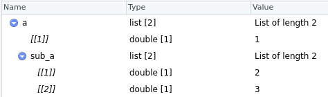
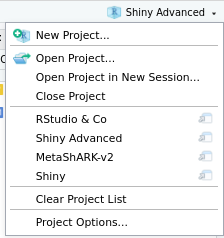

<style>
  page_title {
    font-size: 38px;
  }

  .col2 {
    columns: 2 200px;
    -webkit-columns: 2 200px;
    -moz-columns: 2 200px;
  }

  .column {
    float: left;
  }
  
  .left {
    width: 70%;
  }
  
  .right {
    width: 30%;
}
  
  .col3 {
    columns: 3 100px;
    -webkit-columns: 3 100px;
    -moz-columns: 3 100px;
  }
</style>

```{r setup, include=FALSE}
library(shiny)
options(shiny.reactlog = TRUE)
knitr::opts_chunk$set(echo = FALSE)
```

## Contenu de la séance

* Rappels sur l'interface RStudio
  - Visualisations
  - Environnements
  - Gestion de projets
* Présentations Rmd
* Ressources diverses


## Rappels sur l'interface

{width=100%}

## Avant d'aller plus loin ...

<center>


RStudio est polyvalent, mais n'est pas parfait !!!

Il fait tout, mais ne fait pas tout bien !

</center>


## RStudio

<div style="font-size: 80px;">

Visualisations

</div>

## Visualisations | Visualiser/gérer les packages dans RStudio

{width=100%}

## Visualisations | Visualiser des variables

```
a <- list(1,
          sub_a = list(2,3))

View(a)
```



## RStudio

<div style="font-size: 80px;">

Environnements

</div>

## Environnements | Un mot sur les environnements


1 environnement = 1 collection de variables, fonctions, ...

1 appel de fonction → 1 environnement "invisible" (variables inaccessibles à l'utilisateur)

1 chargement de package → 1 environnement "visible" (variables accessibles à l'utilisateur)

1(+) script(s) → 1+ environnement(s)

## Environnements | Un mot sur les environnements


**History:** historique des commandes effectuées *via le terminal*

**Connections:** "connections" ouvertes dans la session R (déprécié)

**Git:** intégration des scripts R dans un `git`. Connexion possible à Github.

## RStudio

<div style="font-size: 80px;">

Gestion de projets

</div>

## Gestion de projets | Git et Github

`Git` est un logiciel libre de gestion de versions. On parle de "git" pour définir un 
répertoire de code (repository ou "repo") centré autour d'un projet.

`Github` est une plateforme de développement permettant d'héberger du code sous forme de git.

## Parenthèse: workflow d'un Git

On initialise un git par un premier `commit`: une intégration de fichiers au repository.
On le fait évoluer par commits successif.


## Parenthèse: workflow d'un Git

L'édition du git se fait sur un git alternatif: la `branche` (il peut y en avoir plusieurs).


## Parenthèse: workflow d'un Git

Une fois la fonctionnalité développée complètement, on peut l'intégrer à la branche principale du git.


## Gestion de projets | Cloner un git avec RStudio

Récupérer un git "en local" se fait via:

`File > New project > Version Control > Git`

Puis retranscrire l'URL du git en question.

**Prérequis:**

* avoir un git enregistré sur Github
* avoir installé git sur sa machine


## Gestion de projets | Interface vers un git

La technologie `git` a un vocabulaire propre qui n'est pas forcément évident: "add", "commit", "pull", "push", "merge", "branch", ...

RStudio apporte une interface simple à l'emploi !


## Gestion de projets | Projets R

<div class="column left">
Les projets R permettent:

- de faciliter l'intégration de code à un git
- de définir un environnement propre à un ensemble de scripts
- d'écrire des packages R
- de sauvegarder et reprendre un travail rapidement
</div>

<div class="column right">

</div>
## RStudio

<div style="font-size: 80px;">

Présentations R Markdown

</div>

## Rmd | Introduction

- Markdown: langage de traitement de texte (comme Latex)
- Rmd: traitement de texte incluant du code R

Idéal pour une mise en forme rapide d'un document contenant des scripts R.

Possibilité de le tourner en présentation de type `ioslide`.

## Rmd | Exemple

**En exclusivité,** un texte d'une diversité riche montrant l'ensemble des
*fonctionnalités* accessibles via le `R markdown`.

Ainsi que le code qui l'a produit:

{width=75%}

## Rmd | Bien plus que de texte !

- Possibilité d'inclure une application **Shiny** dans du Rmd.

- Possibilité de faire une **présentation** via Rmd (type ioslides).

- Possibilité d'inclure du **Shiny** dans une **présentation** Rmd.

```{r}
library(shiny)
shinyApp(
  ui = fluidPage(h2("Shiny app example"),
                 textInput("txt_in","Type text here:"),
                 textOutput("txt_out")
                 ),
  server = function(input, output, session){
    output$txt_out <- renderText(input$txt_in)
  }
)
```

## Rmd | Production multi-technique

Le Rmd inclut des éléments:

- de mise en page textuelle
- de programmation web: balises, styles CSS, ...
- calculatoires: visualisations de *plots* 

Polyvalent, mais exigeant:

- difficilement exportable (notamment avec du code Shiny)
- plusieurs fonctionnalités → plusieurs apprentissages̉

## RStudio

<div style="font-size: 80px;">

Ressources diverses

</div>

## Ressources | Quelques asturces utiles ...

- `CTRL+I:` auto-indentation
- `CTRL+D:` supprime une ligne entière
- `CTRL+MAJ+C:` commente une ligne entière
- Ecrire "`# <commentaire> ----`":  
crée une section nommée "`<commentaire>`"  
 (coin supérieur droit des `Scripts`)  
- `flèches haut/bas:` naviguer dans l'historique des lignes de code exécutées
- Fonction `browser()`: met en pause le script en exécution pour laisser la main

## Ressources | Cheatsheets

Toutes les fonctionalités peuvent être résumées via les *cheatsheets*.

{width=70%}

## Ressources | Veiller RStudio

L'ensemble des packages utilisés et présentés se retrouvent sur 
le [compte Github](https://github.com/rstudio) de RStudio.