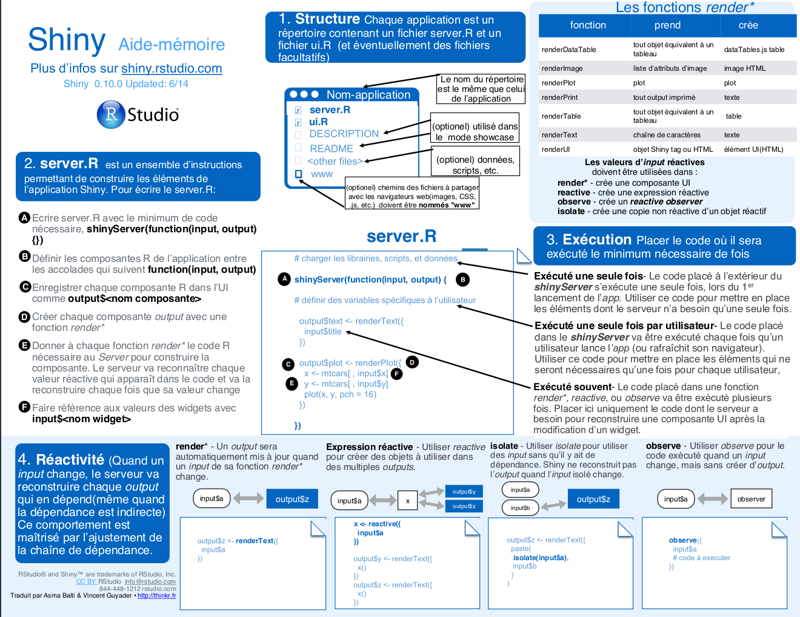

<style>
  .col2 {
    columns: 2 200px;
    -webkit-columns: 2 200px;
    -moz-columns: 2 200px;
  }

  .col3 {
    columns: 3 100px;
    -webkit-columns: 3 100px;
    -moz-columns: 3 100px;
  }
</style>

```{r setup, include=FALSE}
library(shiny)
options(shiny.reactlog = TRUE)
knitr::opts_chunk$set(echo = FALSE)
```

## Contenu de la présentation

Contenu de la séance:

* Notion de Design Pattern
* Modules R Shiny
* Génération procédurale d'UI

## Design Pattern | Principe

Les *design patterns* sont des "**bonnes pratiques** (...) pour la résolution d'un ou de plusieurs problèmes de conception"[^1] d'application. 

Il s'agira donc fondamentalement d'une conception de logiciel efficace sur de nombreux points (validité, robustesse, intégrité, modularité, ...) qui sera reprise par d'autres développeurs.

## Design Pattern | Comment les (ré)employer

La définition d'un design pattern se fait par plusieurs éléments:

* définition des éléments du pattern
* documentation des différents éléments ("principes actifs")

## Design Pattern | Exemple: le *wrapper pattern*

**Principe:** utiliser une fonction en y joignant des fonctionnalités supplémentaires.

**Structure:** définir une fonction ainsi:
```
wrapper <- function(fun, ...) {
  args <- list(...)
  # any operation on args
  return( fun(x, args) )
}
value <- <any_value>
wrapper(fun(value), ...) # return fun(value, ...)
```

**Note:** ... (l'ellipse) se réfère à n'importe quel nombre d'arguments.

## Shiny

<div style="font-size: 80px;">

Modules

</div>

## Modules | Le problème

Une application Shiny est avant tout **un script R**. Il faut donc résoudre les problèmes habituels:

* debugging: localiser les erreurs
* améliorer la lisibilité/réutilisabilité du script
* réemployer les fonctionnalités

## Modules | Comment faire

**Principe:** écrire un script à part pour chaque fonctionnalité souhaitée.

**Structure:** chaque partie (UI, server) du module va être contenu dans une fonction.  
Dans le script principal (`main.R`): appel des éléments du module
```
common_id <- "server"

shinyApp(
  ui = moduleUI(common_id),
  server = callModule(module, common_id)
)
```

## Modules | Comment faire (suite)

Dans le script du module (`module.R`): écriture des différents éléments de saisie avec un espace de nom (fonction `ns()`)
```
serverUI <- function(id, ...){
  ns <- NS(id) # définit un namespace(1) pour le module
  
  return(
    # éléments d'UI souhaités, e.g.
    fluidPage(
      textInput(ns("text_in"), "Saisissez du texte"),
      textOutput(ns("text_out"))
    )
  )
}
```

## Modules | Comment faire (suite et fin)

Dans le script du module (`module.R`): interfaçage avec la GUI par les variables `input`
```
server <- function(input, output, session){
  ns <- session$ns # définit un namespace(1) pour le module
  
  # simplement:
  output$text_out <- reactive(input$text_in)
}
```

## Modules | Extension du design pattern

Chaque fonction modulaire ( moduleUI() et module() ) peuvent recevoir des arguments supplémentaires:
```
moduleUI <- function(id, ...){ ... }

module <- function(input, output, session, ...)
```
Et doivent être appelées ainsi:
```
moduleUI(id, ...)

callModule(module, id, ...)
```

## Modules | Namespaces

Un **espace de nom** dans Shiny est un préfixe attribué à:

* tous les `id` de structures de saisie ou retour d'une GUI.
  (Attribution manuelle produite via la fonction NS)  
  E.g. `ns("text_in")` = `"server-text_in"`
* tous les `id` des variables input et output d'un server.
  (Attribution automatique pour les variables d'un server)  
  E.g. `input$text_in` = `input[["server-text_in"]]`

## Modules | Instanciation

Appeler plusieurs fois un module est possible avec à chaque fois un *id* différent. Cela produira plusieurs instances d'un même module.

```
# Dans la GUI de main.R:
ui <- fluidPage(
  moduleUI("module1"),
  moduleUI("module2")
)

server <- function(input, output, session){
  callModule(module, "server1")
  callModule(module, "server2")
}
```

## Shiny

<div style="font-size: 80px;">

Procedural GUI generation

</div>

## Procedurals | Le problème

Problématiques de visualisation/saisie à partir d'un grand nombre de champs.

Production de GUI variable-dépendante:

* Formulaires de types variables
* Plots de forme adéquate

## Procedurals | Comment faire

**Principe:** produire la GUI depuis le server via `renderUI()`

**Structure:** comme toujours, en deux parties: GUI et server.

La partie GUI est la plus simple: 
```
proceduralUI <- function(id){
  ns <- NS(id)
  
  return(
    uiOutput(ns("proceduralUI"))
  )
}
```
La partie server se base sur:  

* la variable d'entrée (argument du server)
* la sortie 

## Procedurals | Comment faire (suite)

Génération de GUI

```
server <- function(input, output, session, var){
  ns <- session$ns # essentiel !
  
  output$proceduralUI <- renderUI({
    tagList(
      lapply(var, function(element){
        element_id <- build_id(element) # build id from element
        switch(determination(element), # e.g. determination = typeof
               # utilisation de ns() !
               mode1 = UI_function(ns(element_id)),
               [...],
               UI_default(ns(element_id))
        )
      })
    )
  })
}
```

## Procedurals | Comment faire (suite)

Puis génération d'`eventReactive()` pour chaque element.

```
rv <- reactiveValues()

observe(
  sapply(var, function(element){
    element_id <- build_id(element)
    rv[[element_id]] <- eventReactive(input[[element_id]],
      tmp <- input[[element_id]]
      # ...
      return(tmp)
    )
  })
)
```

## Ressources | Cheatsheet

{width=100%}

## Ressources | Références

* [RStudio Shiny]( https://shiny.rstudio.com/): articles et tutoriels pour appréhender les bases de Shiny
* Développeurs Shiny: actifs sur Github
  - Joe Cheng
  - Dean Attali
  
[^1]: définition tirée de "La notion de Design Pattern" by [Openclassroom](https://openclassrooms.com/fr/courses/1782251-creez-des-applications-de-qualite-avec-le-design-pattern-mvc/2370861-la-notion-de-design-pattern)