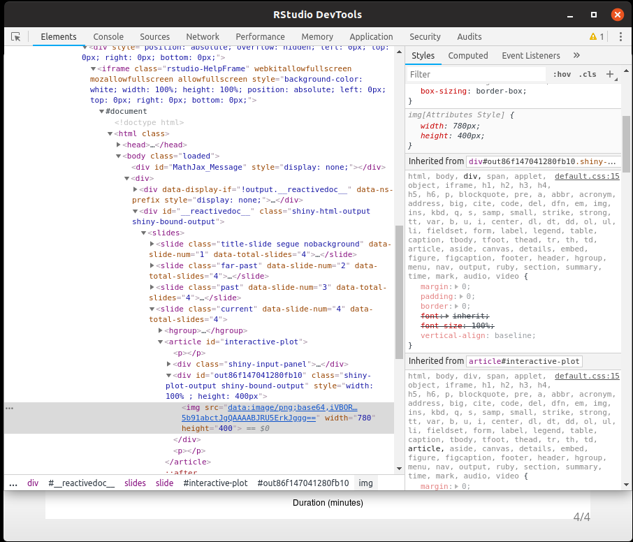

<style>
  .col2 {
    columns: 2 200px;         /* number of columns and width in pixels*/
    -webkit-columns: 2 200px; /* chrome, safari */
    -moz-columns: 2 200px;    /* firefox */
  }
  .col3 {
    columns: 3 100px;
    -webkit-columns: 3 100px;
    -moz-columns: 3 100px;
  }
</style>

```{r setup, include=FALSE}
knitr::opts_chunk$set(echo = FALSE)
```

## Contenu de la présentation

Contenu de la séance:

* Présentation de R Shiny
* Construire une application
  + Interface utilisateur
  + Serveur
  + Ergonomie
* Shiny avancé

## Présentation de Shiny

**Shiny** est ...

* un *package* R
* un outil de *communication*
* une interface *R - HTML*
* un support d'*apprentissage*

## Présentation de Shiny

### Exemple: Interactive Plot

```{r eruptions}
inputPanel(
  selectInput("n_breaks", label = "Number of bins:",
              choices = c(10, 20, 35, 50), selected = 20),
  
  sliderInput("bw_adjust", label = "Bandwidth adjustment:",
              min = 0.2, max = 2, value = 1, step = 0.2)
)

renderPlot({
  hist(faithful$eruptions, probability = TRUE, breaks = as.numeric(input$n_breaks),
       xlab = "Duration (minutes)", main = "Geyser eruption duration")
  
  dens <- density(faithful$eruptions, adjust = input$bw_adjust)
  lines(dens, col = "blue")
})
```

## Présentation de Shiny

### Code HTML ...




<!--

```{r img-code-html}
shinyApp(
  ui = fluidPage(
    div(
      imageOutput("img"),
      style="text-align: center;"
    )
  ),
  
  server = function(input,output,session){
    output$img <- renderImage({
      list(src = "HTML-code.png",
           width = "70%",
           height = "100%")
    }, deleteFile = FALSE)
  }
)
```
-->
## Présentation de Shiny

### ... rendu via R !

```{r img-code-shiny}
shinyApp(
  ui = fluidPage(
    div(
      imageOutput("img"),
      style="text-align: center;"
    )
  ),
  
  server = function(input,output,session){
    output$img <- renderImage({
      list(src = "additionalDoc/Shiny-code.png",
           width = "100%",
           height = "70%")
    }, deleteFile = FALSE)
  }
)
```


## Construire une application

```{r img-how-shiny-works}
shinyApp(
  ui = fluidPage(
    div(
      imageOutput("img"),
      style="text-align: center;"
    )
  ),
  
  server = function(input,output,session){
    output$img <- renderImage({
      list(src = "additionalDoc/shiny-schema.png",
           width = "90%",
           height = "100%")
    }, deleteFile = FALSE)
  }
)
```

## Construire une application

L'application est lancée via une fonction prenant deux arguments:

* `ui` pour l'interface utilisateur
* `server` pour l'interactivité de l'application

La forme la plus simple est d'écrire en un seul script:
```
library(shiny)

ui <- fluidPage(
  *votre interface utilisateur ici* )
server <- function(input, output, session) {
  *vos traitements de données ici* }

shinyApp(ui, server)
```

## Produire une interface utilisateur

L'interface utilisateur se décline en deux principales catégories de fonctions:

* structurantes: `fluidPage()`, `fluidRow()`, `column()`, `div()`, ...
* interactives: `*Input()` pour les saisies, `*Output()` pour les sorties

D'autres fonctions existent mais s'adressent davantage à des utilisateurs 
expérimentés.

## Produire une interface utilisateur

### Fonctions structurantes

Elles organisent l'affichage de la page. Il faut voir les différents appels
de fonction comme les différentes couches d'une image.
Le cas général est l'emploi de `fluidPage()` comme "arrière-plan". Elle va créer
une page vide.

<div class="col2">
```{r shiny-background}
library(shiny)
cat("Sans fluidPage")
shinyApp(ui = NULL, server = function(input,output,session){})
cat("Avec fluidPage")
shinyApp(ui = fluidPage("Affiché via une fluidPage."), server = function(input,output,session){})
```
</div>

## Produire une interface utilisateur

### Fonctions structurantes 2

On peut effectuer un découpage par lignes ou colonnes avec `fluidRow()` et 
`column()`, deux fonctions simples et efficaces. 

```{r shiny-row-columns}
library(shiny)
shinyApp(ui = fluidPage(
                column(4,
                       div(
                         "column()",
                         style = "background: green; height: 200px;")
                       ),
                column(8,
                       div(
                         "column()",
                         fluidRow(
                           div(
                             "fluidRow()",
                             style = "background: blue; height: 100px;"
                           )
                         ),
                         fluidRow(
                           div(
                             "fluidRow()",
                             style = "background: orange; height: 100px;"
                           )
                         ),
                         style = "background: red; height: 200px;")
                       )
        ), 
        server = function(input,output,session){}
)
```

## Ecrire un Serveur


## Elaborer l'ergonomie