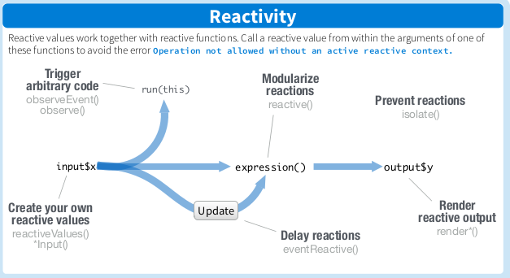

<style>
  .col2 {
    columns: 2 200px;
    -webkit-columns: 2 200px;
    -moz-columns: 2 200px;
  }

  .col3 {
    columns: 3 100px;
    -webkit-columns: 3 100px;
    -moz-columns: 3 100px;
  }
</style>

```{r setup, include=FALSE}
library(shiny)
options(shiny.reactlog = TRUE)
knitr::opts_chunk$set(echo = FALSE)
```

## Contenu de la présentation

Contenu de la séance:

* Présentation de R Shiny
* Construire une application
  + Interface utilisateur
  + Serveur
  + Ergonomie

## Présentation de Shiny

**Shiny** est ...

* un *package* R
* un outil de *communication*
* une interface *R - HTML*
* un support d'*apprentissage*

## Présentation de Shiny | Exemple: Interactive Plot

```{r eruptions}
inputPanel(
  selectInput("n_breaks", label = "Number of bins:",
              choices = c(10, 20, 35, 50), selected = 20),

  sliderInput("bw_adjust", label = "Bandwidth adjustment:",
              min = 0.2, max = 2, value = 1, step = 0.2)
)

renderPlot({
  hist(faithful$eruptions, probability = TRUE, breaks = as.numeric(input$n_breaks),
       xlab = "Duration (minutes)", main = "Geyser eruption duration")

  dens <- density(faithful$eruptions, adjust = input$bw_adjust)
  lines(dens, col = "blue")
})
```

## Présentation de Shiny | Code HTML ...

<center>
  { width=60% }
</center>

## Présentation de Shiny | ... rendu via R !

```
inputPanel(
  selectInput("n_breaks", label = "Number of bins:",
              choices = c(10, 20, 35, 50), selected = 20),

  sliderInput("bw_adjust", label = "Bandwidth adjustment:",
              min = 0.2, max = 2, value = 1, step = 0.2)
)

renderPlot({
  hist(faithful$eruptions, probability = TRUE, breaks = as.numeric(input$n_breaks),
  xlab = "Duration (minutes)", main = "Geyser eruption duration")

  dens <- density(faithful$eruptions, adjust = input$bw_adjust)
  lines(dens, col = "blue")
})
```

## Construire une application | La logique Shiny

<center>
  { width=80% }
</center>

## Construire une application | Ecriture d'une application

L'application est lancée via une fonction prenant deux arguments:

* `ui` pour l'interface utilisateur
* `server` pour l'interactivité de l'application

La forme la plus simple est d'écrire en un seul script:
```
library(shiny)

ui <- fluidPage(
  *votre interface utilisateur ici* )
server <- function(input, output, session) {
  *vos traitements de données ici* }

shinyApp(ui, server)
```

## Produire une interface utilisateur | Ecriture d'une interface utilisateur (UI)

L'interface utilisateur se décline en deux principales catégories de fonctions:

* structurantes: `fluidPage()`, `fluidRow()`, `column()`, `div()`, ...
* interactives: `*Input()` pour les saisies, `*Output()` pour les sorties

D'autres fonctions existent mais s'adressent davantage à des utilisateurs
expérimentés.

## Produire une interface utilisateur | Fonctions structurantes

Elles organisent l'affichage de la page. Il faut voir les différents appels
de fonction comme les différentes couches d'une image.
Le cas général est l'emploi de `fluidPage()` comme "arrière-plan". Elle va créer
une page vide.

<div class="col2">
```{r shiny-background}
library(shiny)
cat("Sans fluidPage")
shinyApp(ui = NULL, server = function(input,output,session){})
cat("Avec fluidPage")
shinyApp(ui = fluidPage("Affiché via une fluidPage."), server = function(input,output,session){})
```
</div>

## Produire une interface utilisateur | Fonctions structurantes 2

On peut effectuer un découpage par lignes ou colonnes avec `fluidRow()` et
`column()`, deux fonctions simples et efficaces.

```{r shiny-row-columns}
library(shiny)
shinyApp(ui = fluidPage(
                column(4,
                       div(
                         "column()",
                         style = "background: green; height: 200px;")
                       ),
                column(8,
                       div(
                         "column()",
                         fluidRow(
                           div(
                             "fluidRow()",
                             style = "background: blue; height: 100px;"
                           )
                         ),
                         fluidRow(
                           div(
                             "fluidRow()",
                             style = "background: orange; height: 100px;"
                           )
                         ),
                         style = "background: red; height: 200px;")
                       )
        ),
        server = function(input,output,session){}
)
```

## Produire une interface utilisateur | Fonctions interactives

La première famille de fonctions interactives est celle des `*Input()`:

* `textInput()` : saisie de texte
* `numericInput()` : saisie de chiffres
* `fileInput()` : chargement de fichiers
* `sliderInput()` : saisie d'entier dans un intervalle
* `selectInput()` : choix parmi options
* `dateInput()` : saisie de dates
* ... et de nombreux autres types et variantes !

## Produire une interface utilisateur | Fonctions interactives

La seconde famille de fonctions interactives est celle des `*Output()`:

* `textOutput()` : saisie de texte
* `tableOutput()` : chargement de fichiers
* `plotOutput()` : saisie d'entier dans un intervalle
* `imageOutput()` : choix parmi options
* ... et de quoi afficher des contenus de types variables !

En particulier, il existe toujours une manière d'adapter une visualisation
souhaitée, notamment tant qu'elle peut paraître via un `plot` classique sous R.

## Ecrire un Serveur | Les variables particulières

Un `server` est une fonction prenant trois arguments:

* `input` : une liste réactive (`reactiveValues`) contenant les valeurs saisies via `*Input()`
* `output` : une liste réactive recevant les valeurs traitées dans `server`
* `session` : une variable "magique" qui fait que Shiny fonctionne

```
server <- function(input, output, session){
  ...
}
```

## Ecrire un Serveur | La réactivité

Ou comment *guider* l'information à travers les fonctions de traitement souhaitées.

<center>
  { width=80% }
</center>

## Ecrire un Serveur | Structurer la réactivité

Le `server` agit par fonctions contenant des morceaux de code R à exécuter
lorsqu'il est souhaitable, ce qu'on peut *contrôler*.

* `observe()`, `reactive()` : exécutent leur contenu lorsqu'une partie du
contenu varie
* `observeEvent()`, `eventReactive()` : identique aux précédentes, mais ne
s'exécutent que lorsqu'un *événement* survient
* `reactiveValues()` : crée une *liste réactive* permettant de stocker les
valeurs souhaitées (e.g. variables temporaires)
* `isolate()` : le code contenu dans cette fonction n'est pas réactif

## Ecrire un Serveur | Traiter les données

Les traitements sont effectués au gré de l'utilisateur, et le retour à
l'utilisateur s'effectue via les fonctions `render*()`:

* `renderText()` : formatte la donnée en texte
* `renderPlot()` : formatte la donnée en graphique
* `renderTable()` : formatte la donnée en affichage tabulé
* `renderUI()` : formatte la donnée en interface graphique (très polyvalent)
* ...

Ces rendus, comme les fonctions dans l'UI, produisent des fragments de code HTML.

## Ecrire un Serveur | Le couplage serveur / UI

En quelques règles simples:

* Chaque fonction `*Input()`  et `*Output()` est dotée d'un identifiant *id*.
* Chaque fonction `*Input()` va créer un élément nommé *id* à la variable
`input` de `server`
* Chaque retour de fonction `render*()` va être stocké dans un élement nommé *id* de la
variable `output` de `server`

## Ecrire un Serveur | Le couplage serveur / UI

```
shinyApp(
  ui <- fluidPage(
    # saisie de texte
    textInput(inputId = "text_in", label = "Ecrivez ici:"),

    # sortie de texte
    textOutput(outputId = "text_out")
  ),

  server <- function(input, output, session){
    # on renvoie exactement le même texte
    output$text_out <- reactive({
      input$text_in
    })
  }
)
```

## Ecrire un Serveur | Le couplage serveur / UI

```{r}
library(shiny)

shinyApp(
  ui <- fluidPage(
    fluidRow(
      column(6,
             # saisie de texte
             textInput(inputId = "text_in", label = "Ecrivez ici:"),

             # sortie de texte
             textOutput(outputId = "text_out")
      ),
      column(6,
             h3("CTRL + F3: reactlog"),
             actionButton("tog",">>> CTRL + F3 <<<")
      )
    ),
    fluidRow(
      imageOutput("img")
    )
  ),

  server <- function(input, output, session){

    # on renvoie exactement le même texte
    output$text_out <- reactive({
      input$text_in
    })


    observeEvent(input$tog,{
      output$img <- renderImage(list(src = "www/reactlog.png"), deleteFile = FALSE)
    })
  }
)
```

## Elaborer l'ergonomie | Guider l'utilisateur en 3 points

* Améliorer la structure de l'application
  + shinydashboard
  + shinymaterial
* Rendre l'application visuellement agréable
* Interagir dynamiquement avec l'utilisateur

## Elaborer l'ergonomie | Améliorer la structure de l'application

```{r shinydashboard, echo=FALSE, message=FALSE, warning=TRUE}
invisible(library(shinydashboard))

ui <- dashboardPage(
  dashboardHeader(title = "Basic dashboard"),
  dashboardSidebar(
    sidebarMenu(
      menuItem("Dashboard", tabName = "dashboard", icon = icon("dashboard")),
      menuItem("Widgets", tabName = "widgets", icon = icon("th"))
    )
  ),
  dashboardBody(
    tabItems(
      # First tab content
      tabItem(tabName = "dashboard",
        fluidRow(
          box(plotOutput("plot1", height = 250)),

          box(
            title = "Controls",
            sliderInput("slider", "Number of observations:", 1, 100, 50)
          )
        )
      ),

      # Second tab content
      tabItem(tabName = "widgets",
        h2("Widgets tab content")
      )
    )
  )
)

server <- function(input, output) {
  set.seed(122)
  histdata <- rnorm(500)

  output$plot1 <- renderPlot({
    data <- histdata[seq_len(input$slider)]
    hist(data)
  })
}

shinyApp(ui, server)
```

## Elaborer l'ergonomie | Améliorer la structure de l'application

```{r shinymaterial}
library(shinymaterial)

# Wrap shinymaterial apps in material_page
ui <- material_page(
  title = "Basic Page + Side-Nav with Tabs",
  nav_bar_fixed = TRUE,
  # Place side-nav in the beginning of the UI
  material_side_nav(
    fixed = TRUE,
    # Place side-nav tabs within side-nav
    material_side_nav_tabs(
      side_nav_tabs = c(
        "Example Side-Nav Tab 1" = "example_side_nav_tab_1",
        "Example Side-Nav Tab 2" = "example_side_nav_tab_2"
      ),
      icons = c("cast", "insert_chart")
    )
  ),
  # Define side-nav tab content
  material_side_nav_tab_content(
    side_nav_tab_id = "example_side_nav_tab_1",
    tags$h1("First Side-Nav Tab Content")
  ),
  material_side_nav_tab_content(
    side_nav_tab_id = "example_side_nav_tab_2",
    tags$h1("Second Side-Nav Tab Content")
  )
)

server <- function(input, output) {

}
shinyApp(ui = ui, server = server)
```

## Elaborer l'ergonomie | Rendre l'application visuellement agréable

Il est possible de jouer avec les apparences, les couleurs, les affichages, via
la balise `style`.

```{r style}
shinyApp(
  fluidPage(
    div("Lorem ipsum dolor sit amet, consectetur adipiscing elit, sed do eiusmod tempor incididunt ut labore et dolore magna aliqua. Ut enim ad minim veniam, quis nostrud exercitation ullamco laboris nisi ut aliquip ex ea commodo consequat. Duis aute irure dolor in reprehenderit in voluptate velit esse cillum dolore eu fugiat nulla pariatur. Excepteur sint occaecat cupidatat non proident, sunt in culpa qui officia deserunt mollit anim id est laborum.",
        style="background: black;
               color: white;
               font-family: BlackChancery;
               font-size: 1.5em;
               margin: 5px;
               padding: 5px;"),
    actionButton("button","Ne pas appuyer !",
                 style = "color: red;
                          margin: 5px;
                          padding: 5px;"),
    style="margin: 5px;
           padding: 5px;"
  ),
  function(input,output,session){}
)
```

## Elaborer l'ergonomie | Rendre l'application visuellement agréable

`style` fait appel à des *propriétés CSS*. Cette méthode de mise en forme est
complètement documentée via {width=20%}

```
shinyApp(
  fluidPage(
    div("Lorem ipsum ...",
        style="background: black; color: white; font-family: BlackChancery;
        font-size: 1.5em; margin: 5px; padding: 5px;"),
    actionButton("button","Ne pas appuyer !",
                 style = "color: red; margin: 5px; padding: 5px;")
  ),
  function(input,output,session){}
)
```

## Elaborer l'ergonomie | Interagir dynamiquement avec l'utilisateur

<div class="col2">
Afficher / masquer des éléments d'interface en fonction des actions de
l'utilisateur

* minimise l'information à l'écran
* contrôle les actions de l'utilisateur

```{r hide-show}
library(shiny)
shinyApp(
  ui = fluidPage(
    shinyjs::useShinyjs(),
    shinyjs::inlineCSS(list(.big = "font-size: 2em")),
    div(id = "myapp",
        h2("shinyjs demo"),
        checkboxInput("big", "Bigger text", FALSE),
        textInput("name", "Name", ""),
        a(id = "toggleAdvanced", "Show/hide advanced info", href = "#"),
        shinyjs::hidden(
          div(id = "advanced",
            numericInput("age", "Age", 30),
            textInput("company", "Company", "")
          )
        ),
        p("Timestamp: ",
          span(id = "time", date()),
          a(id = "update", "Update", href = "#")
        ),
        actionButton("submit", "Submit"),
        actionButton("reset", "Reset form")
    )
  ),

  server = function(input, output) {
    observe({
      shinyjs::toggleState("submit", !is.null(input$name) && input$name != "")
    })

    shinyjs::onclick("toggleAdvanced",
                     shinyjs::toggle(id = "advanced", anim = TRUE))    

    shinyjs::onclick("update", shinyjs::html("time", date()))

    observe({
      shinyjs::toggleClass("myapp", "big", input$big)
    })

    observeEvent(input$submit, {
      shinyjs::alert("Thank you!")
    })

    observeEvent(input$reset, {
      shinyjs::reset("myapp")
    })    
  }
)
```
</div>
